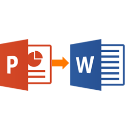
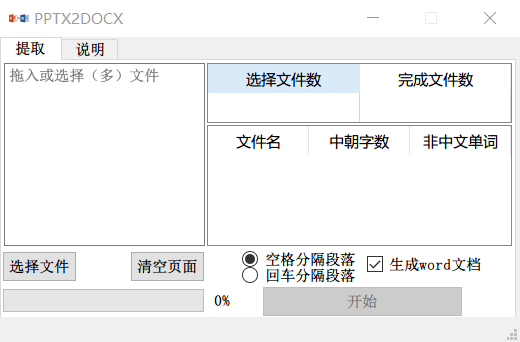

  

# pptx2docx_多线程

- 本项目以PyQt5实现GUI界面
- 支持文件**拖拽**单/多个到界面的最上TextEdit控件。
- 实现*.pptx内文字的提取，格式保存为*.docx
- 自带字数统计的功能，可不生成\*.docx直接统计\*.pptx字数

# 说明

- 在Win7 x64、Win10 x64位均可运行；

- 由于使用python-pptx库，所以仅支持\*.pptx格式，\*.ppt批量转为\*.pptx软件也内有教程链接：<https://blog.csdn.net/wayne1000/article/details/104376239>；

- 且python-pptx库限制pptx内的**SmartArt图形**格式文字的访问，故本项目不能提取（或统计）SmartArt图形的文字，不过大多数PPT还是很少使用SmartArt图形；

- 字数统计结果和Word字数统计结果有稍许差别，还是建议生成Word文件统计字数。Word批量统计字数软件的链接<>;我就不重复造轮子了；

- 本项目更新为多线程版本。

# 下载

  https://lanzous.com/ibk3omf

# 联系

  有任何问题还希望您联系我的邮箱liufeiyafly@163.com，谢谢您！
